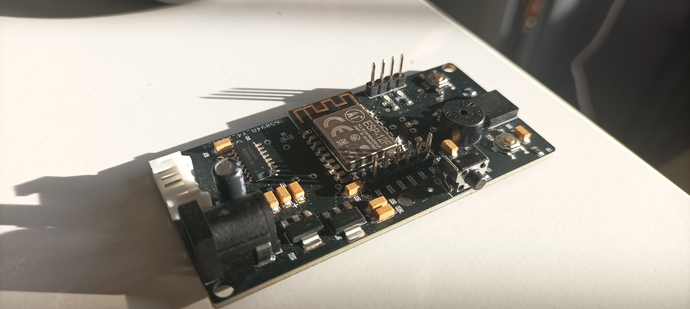

# 🐱 Smart Pet Feeder

[](https://opensource.org/licenses/MIT)
[](https://www.espressif.com/en/products/socs/esp8266)
[](https://platformio.org/)

<div align="center">
  
</div>


</div>

## 📝 Description

This project implements an automatic pet feeder using an ESP8266. The system allows scheduling feeding times and monitoring the food dispenser status.

## ✨ Features

- 🕒 Feeding schedule programming
- 📱 Remote monitoring
- 📶 WiFi control
- 🔋 Low power consumption

## 📁 Project Structure

```
├── 📄 README.md               # Project presentation
├── 📂 docs/
│   └── 📄 full_documentation.md  # Extended technical documentation
├── 📂 hardware/
│   ├── 📄 PCB_layout.json     # PCB design (EasyEDA)
│   ├── 📄 schematic.pdf       # Exported schematic
│   ├── 📄 bom.csv            # Bill of materials
│   └── 📂 gerbers/           # Gerber files folder
├── 📂 firmware/              # ESP8266 code
│   └── 📄 main.c
├── 📂 images/
│   ├── 📄 pcb_photo.jpg
│   └── 📄 assembled.jpg
```

## 🛠️ Requirements

- 🔌 ESP8266
- ⚙️ Servo Motor
- 📊 Level Sensor
- 🔌 5V Power Supply
- 🏗️ 3D Printed Enclosure

## 📥 Installation

1. 📥 Clone the repository
   ```bash
   git clone https://github.com/yourusername/smart-pet-feeder.git
   ```
2. 📦 Install dependencies
   ```bash
   cd smart-pet-feeder
   platformio run
   ```
3. ⚡ Compile and upload firmware
   ```bash
   platformio run --target upload
   ```

## 📄 License

This project is licensed under the MIT License - see the [LICENSE](LICENSE) file for details.

---

<div align="center">
  <sub>Built with ❤️ by <a href="https://github.com/yourusername">Your Name</a></sub>
</div>
